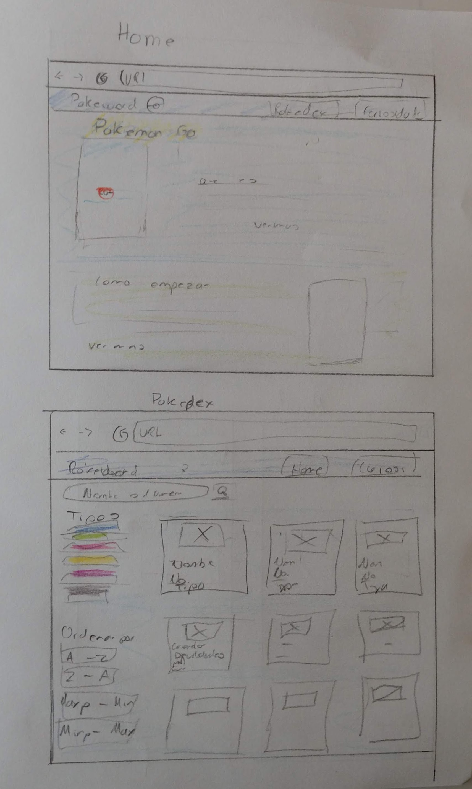
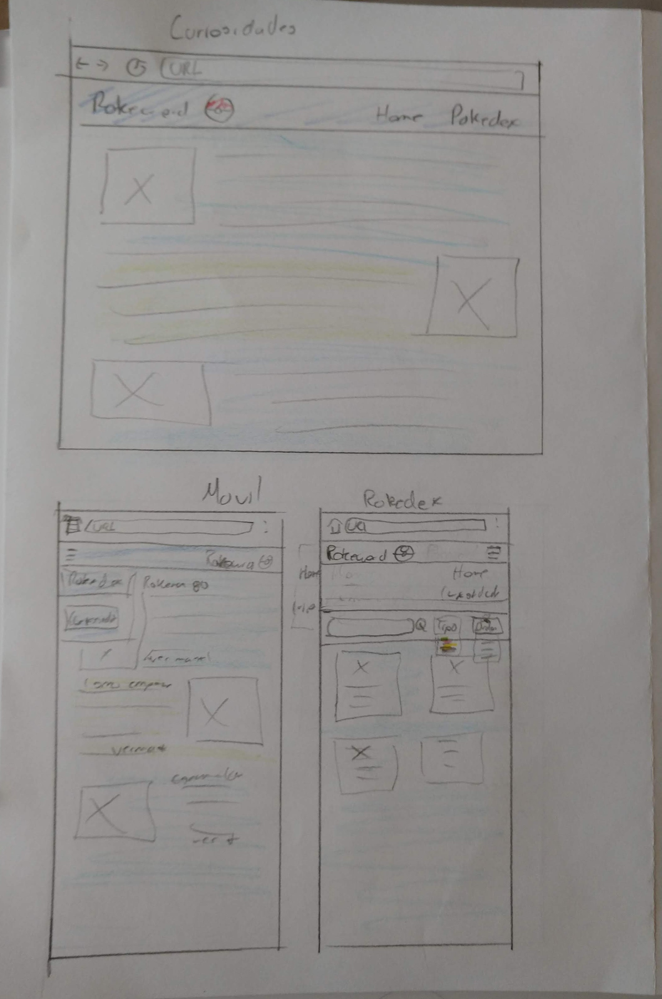

## DataLovers Pokemon

## Preámbulo
Pokemon es una franquicia que tiene sus orígenes en un videojuego RGB que debido a su popularidad traspasó plataformas y medios, llegando a la televisión en 1997 y a partir de entonces se posiciona como una de las franquicias más grandes de la compañia Nintendo.

En 2016 es lanzado un nuevo juego de pokemon, para dispositivos móviles, que mediante el uso de realidad aumentada da a los usuarios la posibilidad de atrapar y entrenar pokemons que pueden ser usados posteriormente en diversa batallas. Gracias a esto Nintendo rompe barreras y se da la posibilidad de jugar a quienes no son consumidores de las consolas de nintendo.

## Proceso y decisiones de diseño
La finalidad de la página es permitir que los usuarios de la app de Pokemon go conocer un poco más del juego y de los pokemons.

### Ideas de prototiado

## Clientes y relación con el producto

Historias de usuarios:

1.  Como usuario novato de Pokemon go quiero aprender más sobre el juego y los diferentes tipos de pokemons.

¿Quiénes son los principales usuarios de producto?

Jugadores novatos o de ocasión que desconocen datos básicos de los pokemons.

¿Cuáles son los objetivos de estos usuarios en relación con el producto?

Aprender sobre el juego

## Problemas y necesidades del usuario

El principal problema para este tipo de usuarios está en adentrarse en un juego del cual no conoce mucho y en el que el flujo de información constante puede llegar a ser abrumador.

## Herramientas
- Git
- GitHub
- GitHub Pages
- Node.js
- Jest
- Boostrap
- JavaScrip
- Html

Elena Hernández
Lic. en Filosofía  Laboratoria 7ta Generación Sede CDMX
